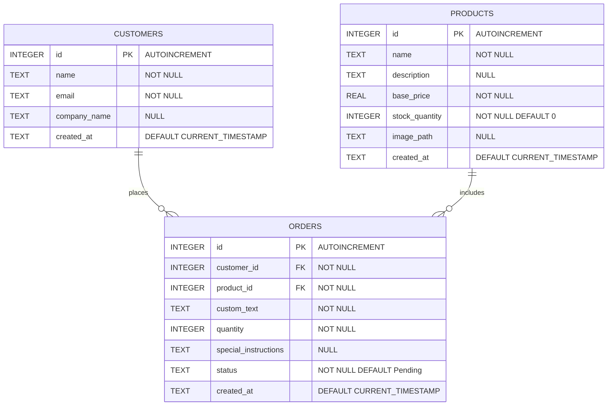

# Mini Retail Order (MRO) 

A small ERP-style retail ordering portal built with **FastAPI**, **SQLite**, **vanilla JavaScript**, and a **shadcn-inspired UI**.

This project simulates a simple business workflow where customers submit custom product orders and an admin team manages order statuses through a dashboard.

## Why I Built This

I built this project to demonstrate practical junior developer skills for business-system and portal development.

The project focuses on:

- Python backend development with FastAPI
- SQLite database design
- Vanilla HTML, CSS, and JavaScript
- Customer-facing order forms
- Admin dashboard workflows
- SQL JOIN queries
- Clean documentation and Git workflow


## Build MRO portal
### 1- Create MRO environment
- Create the project folder
```bash
mkdir mini-retail-order
cd mini-retail-order
```
- Create and activate the virtual environment
```bash
python -m venv .venv
.venv\Scripts\activate
```
- create a README file 
```bash
type nul > README.md
```
---
### 2- Add Basic Project Files Before Connecting to GitHub

Create the basic files needed for the project.

- Create a `.gitignore` file:

```bash
type nul > .gitignore
```

- Open the `.gitignore` file and add this content:

```gitignore
.venv/
__pycache__/
*.pyc
.env
.DS_Store
```

- Create the main Python file:

```bash
mkdir app
type nul > app\main.py
```
- Add a simple test code inside `main.py`:
```python
print("Mini Retail Order project is running!")
```

- Run the Python file to test it:
```bash
python app/main.py
```

You should see:
```bash
Mini Retail Order project is running!
```

---
### 3- Connect the Project to GitHub
- Initialize Git in the project folder:
```bash
git init
```
- Add all project files to Git:
```bash
git add .
```
- Commit the project files:
```bash
git commit -m "Initial project setup"
```
- Rename the main branch to `main`:
```bash
git branch -M main
```
- Connect the local project to the GitHub repository:
```bash
git remote add origin https://github.com/abdwaked2026/mini-retail-order.git
```
- Push the project to GitHub:
```bash
git push -u origin main
```
- Check that the remote repository is connected correctly:

```bash
git remote -v
```
---
### 4- Database (SQLite)
### 4-1 Database GitHub Setup
- Create a new Git branch for the database setup:
```bash
git checkout -b feature/database-setup
```

- Check that you are on the correct branch:
```bash
git status
```
You should see something like:
```text
On branch feature/database-setup
```
### 4-2 Database Setup
- Create the `database` folder:
```bash
mkdir database
```

- Create the database files:
```bash
type nul > database\schema.sql
type nul > database\seed.sql
type nul > database\init_db.py
```

- Create image folder
```bash
mkdir app\static
mkdir app\static\images
```
### 4-3 Database Relationship Diagram

The database has three main tables: `customers`, `products`, and `orders`.



- One customer can place many orders.
- One product can be used in many orders.
- Each order belongs to one customer.
- Each order belongs to one product.
- The `orders` table connects the `customers` table and the `products` table.

### 4-3 Database Execution and Testing
- Build the database
```bash
python database\init_db.py
```

- You should see:
```text
Database created successfully!
Database location: projectPath\mini-retail-order\database\mini_retail_order.db
```
###  4-5 Exclude Database Files in `.gitignore`
- Add these lines to the `.gitignore` file:
```text
*.db
*.sqlite
*.sqlite3
```
### 4-6 Push Database Setup to GitHub

- Check that you are on the database branch:

```bash
git status
```

You should see:

```text
On branch feature/database-setup
```

- Add the database setup files to Git:

```bash
git add .
```

- Commit the database setup:

```bash
git commit -m "Add SQLite database setup"
```

- Push the database branch to GitHub:

```bash
git push -u origin feature/database-setup
```

- Check that everything is pushed:

```bash
git status
```

You should see:

```text
nothing to commit, working tree clean
```

---

### 4-7 Update Local Main Branch After Merging Pull Request

After you merge the pull request on GitHub, update your local `main` branch.

- Switch back to the `main` branch:

```bash
git checkout main
```

- Update the local `main` branch to match GitHub:

```bash
git pull origin main
```

- Check that your local `main` branch is clean:

```bash
git status
```

You should see:

```text
On branch main
Your branch is up to date with 'origin/main'.
nothing to commit, working tree clean
```

---
### 5- Backend Setup with FastAPI
### 5-1 Backend GitHub Setup
- Create a new Git branch for the backend setup:

```bash
git checkout -b feature/backend-setup
git status
```
### 5-2 Install Backend Dependencies
- Create the `requirements.txt` file:
```bash
type nul > requirements.txt
```

- Open `requirements.txt` and add these libraries:
```text
fastapi==0.136.1
uvicorn==0.47.0
```

- Install the libraries from `requirements.txt`:
```bash
pip install -r requirements.txt
```

- Check that the libraries were installed:
```bash
pip list
```

### 5-3 Create Backend Files
- Create the backend files:
```bash
type nul > app\database.py
type nul > app\models.py
```

- Create the routes folder:
```bash
mkdir app\routes
```

- Create route files:
```bash
type nul > app\routes\products.py
type nul > app\routes\customers.py
type nul > app\routes\orders.py
```
---
### 5-4 Run the FastAPI Backend
> **Note:**  
> The `app/main.py` file contains the starter FastAPI code. This code creates the API app and adds a basic `/` route to test that the backend is running.
- Run the backend server:
```bash
uvicorn app.main:app --reload
```

- Open the API in the browser:
```text
http://127.0.0.1:8000
```

- Open the automatic API documentation:
```text
http://127.0.0.1:8000/docs
```
### 5-5 Save and Push Backend Setup

After testing that the FastAPI server works, save the backend setup changes with Git.

```bash
git add app\main.py app\database.py app\models.py app\routes\products.py app\routes\customers.py app\routes\orders.py requirements.txt README.MD
git commit -m "Set up FastAPI backend starter"
git push -u origin feature/backend-setup
```

---
### 6- Frontend setup